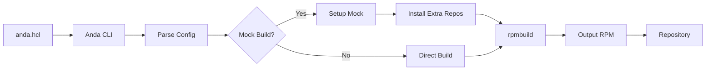
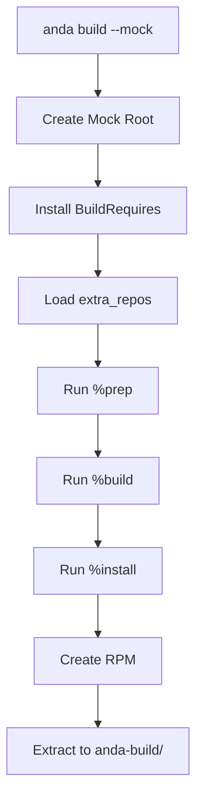
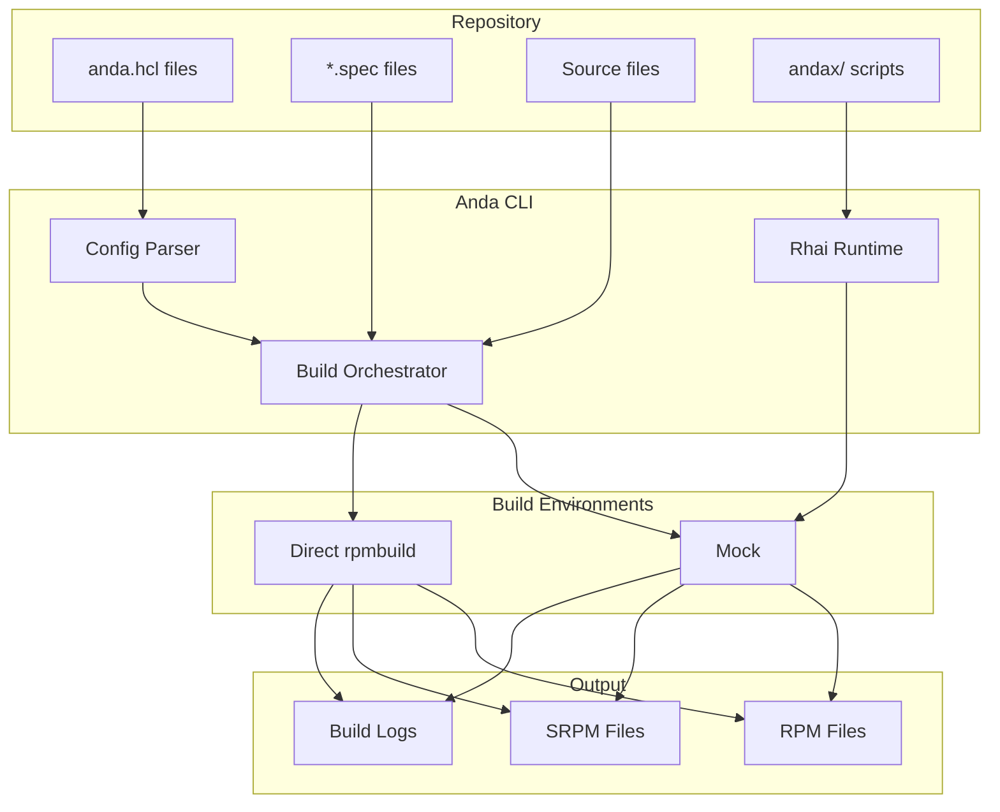

## Overview

Terra uses Anda as its build system, which provides automation for building RPM packages from the monorepo. The build system includes:

- **anda.hcl** - Package configuration files
- **andax/** - Automation scripts written in Rhai
- **CI/CD integration** - GitHub Actions workflows
- **Mock** - Isolated build environments

## Build Process Flow



## Anda Command Line Interface

### Building Packages

<CodeGroup>
```bash Build Single Package
# Build a specific package
cd anda/apps/discord
anda build
```

```bash Build with Mock
# Build in isolated mock environment
anda build --mock
```

```bash Build for Specific Architecture
# Build for different architecture
anda build --arch aarch64
```

```bash Build All Changed
# Build all packages with changes
anda build --changed
```
</CodeGroup>

### Testing Builds

```bash
# Install built package locally
sudo dnf install ./anda-build/RPMS/x86_64/discord-*.rpm

# Test in clean container
podman run -it -v $(pwd):/work:z fedora:rawhide
dnf install /work/anda-build/RPMS/x86_64/discord-*.rpm
```

## Andax Scripts

The `andax/` directory contains Rhai scripts that extend Anda's functionality.

### spec.rhai

Utility functions for parsing RPM spec files:

<CodeGroup>
```javascript spec.rhai
fn get_version() {
    return `(?m)^Version:\s*(.+)$`.find(this.f, 1);
}

fn get_release() {
    let r = `(?m)^Release:\s*(.+)$`.find(this.f, 1);
    r = sub(`(?m)(%\??dist|%\{\??dist\})\s*$`, "", r);
    r.replace("%autorelease", "1");
    return r;
}

fn get_global(macro) {
    return `(?m)^%global\s+${macro}\s+(.+)$`.find(this.f, 1);
}

fn get_define(macro) {
    return `(?m)^%define\s+${macro}\s+(.+)$`.find(this.f, 1);
}
```
</CodeGroup>

**Usage:**

```javascript
import "spec" as rpm;

let spec_file = read_file("package.spec");
let version = rpm::get_version(spec_file);
let release = rpm::get_release(spec_file);
```

### nvidia.rhai

Functions for fetching NVIDIA driver and CUDA component versions:

<CodeGroup>
```javascript nvidia.rhai
fn nvidia_component_list() {
    let url = "https://developer.download.nvidia.com/compute/cuda/redist/";
    let matches = find_all("redistrib_[\\d.]+.json", get(url));
    let series = `${url}${matches[matches.len - 1][0]}`;
    return get(series).json();
}

fn nvidia_component_version(component) {
    let components = nvidia_component_list();
    return components[component]["version"];
}

fn nvidia_driver_version() {
    let driver = get("https://gfwsl.geforce.com/services_toolkit/services/com/nvidia/services/AjaxDriverService.php?func=DriverManualLookup&osID=12&languageCode=1033&numberOfResults=1&beta=0")
        .json().IDS[0].downloadInfo.DisplayVersion;
    return(driver);
}

fn nvidia_legacy_version() {
    let driver = get("https://gfwsl.geforce.com/services_toolkit/services/com/nvidia/services/AjaxDriverService.php?func=DriverManualLookup&osID=12&languageCode=1033&numberOfResults=1&beta=0&release=580")
        .json().IDS[0].downloadInfo.DisplayVersion;
    return(driver);
}
```
</CodeGroup>

**Usage:**

```javascript
import "nvidia" as nv;

let driver_ver = nv::nvidia_driver_version();
let cuda_ver = nv::nvidia_component_version("cuda_cudart");
print(`Latest NVIDIA driver: ${driver_ver}`);
```

### bump_extras.rhai

Helper functions for version tracking across distributions:

<CodeGroup>
```javascript Package Version Helpers
// Get latest version from AlmaLinux repos
fn alma(pkg, repo, branch) {
  let vr = alma_vr(pkg, repo, branch);
  return(vr[1]);
}

// Get latest version from Fedora Bodhi
fn bodhi(pkg, branch) {
    let url = `https://bodhi.fedoraproject.org/updates/?search=${pkg}&status=stable&releases=${branch}&rows_per_page=1&page=1`;
    for entry in get(url).json().updates[0].title.split(' ') {
        let matches = find_all(`${pkg}-([\\d.]+)-(\\d+)\\.[\\w\\d]+$`, entry);
        if matches.len() != 0 {
            return matches[0][1];
        }
    }
}

// Get latest version from Terra repos
fn madoguchi(pkg, branch) {
    return madoguchi_json(pkg, branch).ver;
}

// Get latest release from Codeberg
fn codeberg(repo) {
    return get(`https://codeberg.org/api/v1/repos/${repo}/releases/latest`).json().tag_name;
}
```
</CodeGroup>

**Usage:**

```javascript
import "bump_extras" as bump;

// Check Fedora version
let fedora_ver = bump::bodhi("firefox", "F41");

// Check Codeberg release
let release = bump::codeberg("owner/repo");
```

### get_proj_label.rhai

Extract labels from anda.hcl files:

<CodeGroup>
```javascript get_proj_label.rhai
import "anda::cfg" as cfg;
print(cfg::load_file(labels.project).project.pkg.labels.to_json());
```
</CodeGroup>

**Usage in CI:**

```bash
# Get subrepo label for a package
anda run andax/get_proj_label.rhai --project anda/apps/discord/anda.hcl
```

### CI Scripts

#### update_commit_message.rhai

Generates commit messages for automated updates:

<CodeGroup>
```javascript update_commit_message.rhai
import "anda::cfg" as cfg;

let cmd = `git status | sed -nE '/^\tmodified:/{s@^\tmodified:\s+@@;s@[^/]+$@@;p}' | sort -u`;
let filelist = sh(cmd, #{ "stdout": "piped" }).ctx.stdout.split('\n');

let modified_list = "";
for file in filelist {
	if file.is_empty() { continue; }
	let spec = cfg::load_file(`${file}/anda.hcl`).project.pkg.rpm.spec;
	spec.pop(5); // remove `.spec` suffix
	modified_list += `${spec} `;
}
print(modified_list[..modified_list.len()-1]);
```
</CodeGroup>

#### extra_repos.rhai

Installs extra repositories during mock builds:

<CodeGroup>
```javascript extra_repos.rhai
import "anda::cfg" as cfg;

fn install(labels) {
    if labels.script_path == () {
        print("fatal: labels.script_path is empty");
        terminate();
    }
    let releasever = sh("rpm -E '%fedora'", #{"stdout": "piped"}).ctx.stdout;
    releasever.trim();
    let basearch = sh("rpm -E '%_arch'", #{"stdout": "piped"}).ctx.stdout;
    basearch.trim();
    let hcl = cfg::load_file(sub(`(.+/)[^.]+\\.rhai`, "${1}anda.hcl", labels.script_path));
    for repo in hcl.project.pkg.rpm.extra_repos {
        repo = sub(`\\$releasever`, releasever, repo);
        repo = sub(`\\$basearch`, basearch, repo);
        let filename = sub(`\\W`, "_", repo);
        let file = open_file(`/etc/yum.repos.d/${filename}.repo`);
        file.write(`
[filename]
name=${filename}
baseurl=${repo}
enabled=1
gpgcheck=0
`);
    }
}
```
</CodeGroup>

## Mock Build Environment

Mock provides isolated build environments that prevent dependency pollution.

### When to Use Mock

<Note>
Enable mock builds (`labels.mock = 1`) when:

- Package requires `extra_repos`
- Build has complex dependency chains
- Need guaranteed clean environment
- Package is security-sensitive
</Note>

### Mock Configuration

Mock environments are configured per Fedora version:

```bash
# Default mock config
/etc/mock/fedora-rawhide-x86_64.cfg

# With Terra repos
/etc/mock/terra-rawhide-x86_64.cfg
```

### Mock Build Process



## Build Artifacts

### Directory Structure

```
package-directory/
├── anda.hcl
├── package.spec
├── patch1.patch
├── source1.conf
└── anda-build/
    ├── BUILD/          # Extracted source
    ├── BUILDROOT/      # %install destination
    ├── RPMS/
    │   └── x86_64/
    │       └── package-1.0-1.fc42.x86_64.rpm
    ├── SOURCES/        # Source files
    ├── SPECS/          # Spec file
    └── SRPMS/          # Source RPM
        └── package-1.0-1.fc42.src.rpm
```

### Build Logs

```bash
# View build log
less anda-build/build.log

# Check for errors
grep -i error anda-build/build.log

# View mock logs
less /var/lib/mock/fedora-rawhide-x86_64/result/build.log
```

## CI/CD Integration

### GitHub Actions Workflow

Terra uses GitHub Actions for automated builds:

```yaml
name: Build Packages

on:
  push:
    branches: [ main ]
  pull_request:

jobs:
  build:
    runs-on: ubuntu-latest
    container: ghcr.io/terrapkg/builder:latest
    
    steps:
      - uses: actions/checkout@v4
      
      - name: Build changed packages
        run: |
          anda build --changed
      
      - name: Upload artifacts
        uses: actions/upload-artifact@v4
        with:
          name: rpms
          path: "**/anda-build/RPMS/**/*.rpm"
```

### Build Matrix

Builds run across multiple Fedora versions:

```yaml
strategy:
  matrix:
    fedora: [40, 41, 42, rawhide]
    arch: [x86_64, aarch64]
```

## Troubleshooting

<AccordionGroup>
  <Accordion title="Build fails with missing dependencies">
    **Solution 1:** Add to `BuildRequires` in spec file
    
    ```spec
    BuildRequires:  missing-package-devel
    ```
    
    **Solution 2:** Add extra repository to anda.hcl
    
    ```hcl
    rpm {
      spec = "package.spec"
      extra_repos = ["https://repo.example.com/fedora/\\$releasever/\\$basearch"]
    }
    ```
  </Accordion>
  
  <Accordion title="Mock build fails but direct build works">
    Check that all dependencies are properly declared:
    
    ```bash
    # List actual dependencies
    rpm -qpR package.rpm
    
    # Compare with spec file
    grep "^Requires:" package.spec
    ```
    
    Missing `BuildRequires` often cause mock-only failures.
  </Accordion>
  
  <Accordion title="Extra repos not working">
    Verify repository URL format:
    
    ```hcl
    # Correct - double backslash
    extra_repos = ["https://example.com/\\$releasever/\\$basearch"]
    
    # Wrong - single backslash
    extra_repos = ["https://example.com/\$releasever/\$basearch"]
    ```
  </Accordion>
  
  <Accordion title="Build succeeds but package doesn't install">
    Check file conflicts:
    
    ```bash
    # List package files
    rpm -qpl package.rpm
    
    # Check for conflicts with installed packages
    rpm -qf /conflicting/file
    ```
    
    May need `Conflicts:` or `Obsoletes:` in spec.
  </Accordion>
  
  <Accordion title="Build is too slow">
    **For large packages:**
    
    ```hcl
    labels {
      large = 1
    }
    ```
    
    **Parallelize builds:**
    
    ```spec
    %build
    %cmake_build -j%{_smp_build_ncpus}
    ```
  </Accordion>
</AccordionGroup>

## Advanced Topics

### Custom Build Scripts

Create custom Rhai scripts for specialized workflows:

```javascript
// custom_update.rhai
import "nvidia" as nv;
import "spec" as rpm;

// Get latest NVIDIA version
let latest = nv::nvidia_driver_version();

// Update spec file
let spec = read_file("nvidia.spec");
spec = spec.replace(rpm::get_version(spec), latest);
write_file("nvidia.spec", spec);

print(`Updated to ${latest}`);
```

### Multi-Stage Builds

Some packages require building dependencies first:

```bash
#!/bin/bash
# Build dependency chain

cd anda/lib/library-a
anda build
sudo dnf install ./anda-build/RPMS/x86_64/library-a-*.rpm

cd ../library-b
anda build
sudo dnf install ./anda-build/RPMS/x86_64/library-b-*.rpm

cd ../../apps/application
anda build
```

### Cross-Architecture Builds

```bash
# Build for ARM on x86_64
anda build --arch aarch64

# Requires qemu-user-static
sudo dnf install qemu-user-static
```

## Build System Architecture

### Component Diagram



## Performance Optimization

### Caching

```bash
# Enable ccache for C/C++ builds
export PATH="/usr/lib64/ccache:$PATH"

# Enable sccache for Rust builds
export RUSTC_WRAPPER=sccache
```

### Parallel Builds

```spec
# In spec file %build section
%cmake_build -j%{_smp_build_ncpus}

# Or for make
make -j%{_smp_build_ncpus}
```

### Mock Optimizations

```bash
# Keep mock root between builds
anda build --mock --no-clean

# Use tmpfs for faster builds
mock --enable-plugin=tmpfs
```

## Related Documentation

- [anda.hcl Reference](/reference/anda-hcl) - Configuration file format
- [RPM Spec Reference](/reference/rpm-specs) - Writing spec files
- [Contributing Guide](/contributing) - Submitting packages
- [Rhai Language](https://rhai.rs/book/) - Scripting language documentation
